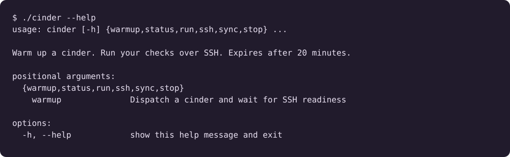

## Demo

<p align="center"> <a href=".github/workflows/cinder.yml"></a> <a href="https://www.python.org/"></a> <a href="docs/setup.md"></a> </p>

<p align="center">  </p>

Cinder runs commands over SSH on an ephemeral GitHub Actions runner. SSH lifetime: 20 minutes. Job timeout: 30 minutes.



## Setup

Requirements: Python 3.10+, GitHub CLI, OpenSSH, rsync, and a connected Tailscale client.

1. Add `.github/workflows/cinder.yml` and the supporting files to a GitHub repository. The workflow must exist on the default branch.
2. Connect the CLI machine to Tailscale:

```bash
brew install tailscale
sudo tailscale up
```

3. Create a Tailscale OAuth client at <https://login.tailscale.com/admin/settings/oauth> with write scopes `auth_keys` and `policy_file`, and `tag:cinder` attached to `auth_keys`. Store its credentials as GitHub secrets:

```bash
export TS_ID='<client-id>'
export TS_SECRET='<client-secret>'
gh auth login
gh secret set TS_OAUTH_CLIENT_ID --repo OWNER/REPO --body "$TS_ID"
gh secret set TS_OAUTH_SECRET --repo OWNER/REPO --body "$TS_SECRET"
```

4. Push the tailnet policy (`tag:cinder` owner and a `tcp:2222` grant from the operator identity):

```bash
export OPERATOR='operator@example.com'
TOKEN=$(curl -sf https://api.tailscale.com/api/v2/oauth/token \
  -d "client_id=$TS_ID" -d "client_secret=$TS_SECRET" | jq -r .access_token)
curl -sf -H "Authorization: Bearer $TOKEN" -H 'Accept: application/json' \
  https://api.tailscale.com/api/v2/tailnet/-/acl \
| jq --arg op "$OPERATOR" '
    .tagOwners["tag:cinder"] = ["autogroup:admin"]
  | .grants = ((.grants // []) + [{"src":[$op],"dst":["tag:cinder"],"ip":["tcp:2222"]}])
  ' > /tmp/cinder-acl.json
curl -sf -X POST -H "Authorization: Bearer $TOKEN" -H 'Content-Type: application/json' \
  --data-binary @/tmp/cinder-acl.json \
  https://api.tailscale.com/api/v2/tailnet/-/acl
```

See [network setup](docs/setup.md) for policy caveats and troubleshooting.

## Usage

```bash
# Start a cinder; stdout contains the generated run ID after SSH becomes available.
CINDER_ID=$(./cinder warmup --repo OWNER/REPO --ref main)

# Upload local changes and run tests remotely.
./cinder sync "$CINDER_ID" .
./cinder run "$CINDER_ID" 'python3 -m unittest discover -s tests -v'

# Inspect status, open an interactive shell, or cancel the run.
./cinder status "$CINDER_ID"
./cinder ssh "$CINDER_ID"
./cinder stop "$CINDER_ID"

# Run local CLI tests.
python3 -m unittest discover -s tests -v
```

`run` accepts one quoted shell command, streams stdout and stderr, and returns the remote exit code. Commands execute in `/home/cinder/workspace` as the unprivileged `cinder` account. Files persist between commands; shell state does not.

`sync` copies files without deleting remote files and excludes `.git/` and `.cinders/`. Local state and SSH keys reside in `.cinders/`. `warmup --wait SECONDS` changes the readiness timeout, not the SSH lifetime.

See [lifecycle and limitations](docs/design.md) and [agent usage](docs/agent.md). Live GitHub and Tailscale integration remains unverified.
# cinders
